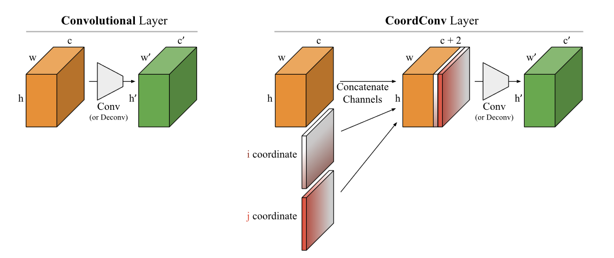

# CoordConv - Implementation
This repository houses my implementations of the CoordConv layer as introduced in paper - [An intriguing failing of convolutional neural networks and the CoordConv solution](https://arxiv.org/pdf/1807.03247.pdf). The layer is implemented in TensorFlow and has taken some inspiration from the code for the layer as shown in the supplementary part of the paper.

## CoordConv Layer
CoordConv is an extension to Convoluton layers just to give the neural network extra understanding of the coordinates of the pixels. The layer keeps two properties of Convolution layer intact:
* few parameters
* efficient computation

But it gives a degree of freedom to network in case of *translation invariance*. It lets the network to decide whether it needs the said property or not.

||
|:--------------------------------------------------:|
|Source: https://arxiv.org/pdf/1807.03247 |

## What is done?
This repository currently houses code for - 
* Supervised Coordinate Classification over the NotSoClever dataset discussed in paper. Read more about it in the notebook [here](./SupervisedPixelClassification.ipynb)

> To visualize the dataset, run `python visualize_coords.py`. For some helpful command line arguments use `python visualize_coords.py -h`

## What is coming up?
I have planned on working with this layer to make:
* Autoencoders
* GANs
* Time Series Related Tasks.

## Reference
* [arXiv:1807.03247](https://arxiv.org/abs/1807.03247)
